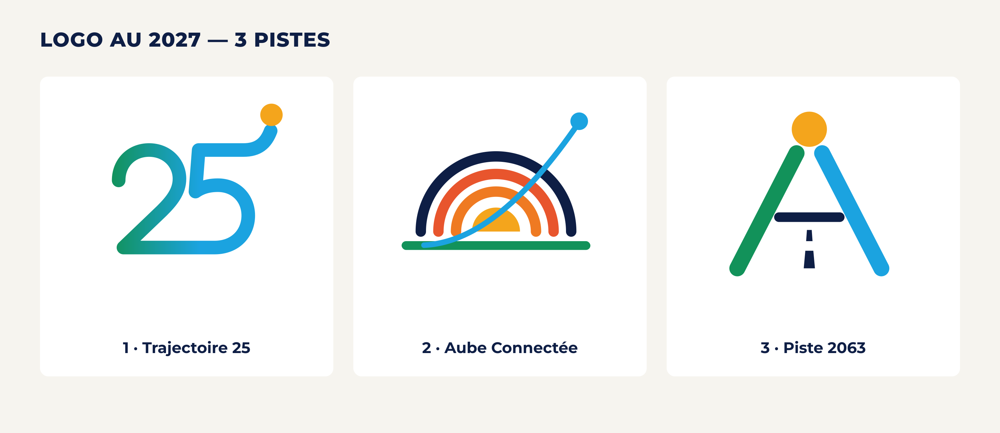

# Logo — Thème de l'année 2027 de l'UA (ébauches)

« *AU at the Dawn of its 25th Anniversary: Leveraging the Full Potential of SAATM and New Technologies for Continental Integration* »

Trois pistes vectorielles, chacune déclinée en couleur, monochrome et inversé, avec planche de présentation, adaptation multilingue et trois maquettes.



## Contenu de chaque dossier de piste

| Fichier | Rôle dans le dossier de candidature |
|---|---|
| `svg/mark_*.svg` | Symbole seul (sans titre) : `color`, `mono-black`, `reversed`, `mono-white` |
| `svg/lockup-horizontal_*.svg`, `svg/lockup-vertical_*.svg` | Logo avec titre de campagne (mêmes 4 versions) |
| `png/planche_presentation_3000px.png` | Planche : logo, versions, test petites tailles, palette, typographie |
| `png/adaptation_multilingue_3000px.png` | Titre en EN, FR, PT, ES, SW, AR |
| `png/maquettes_3000px.png` + `png/maquette_*.png` | Carte numérique, toile de fond d'événement, couverture de publication |

Tous les SVG sont de **vrais vecteurs** : le texte est converti en tracés, sans dépendance aux polices installées. Ils s'ouvrent directement dans Illustrator ou Inkscape, d'où l'on peut exporter `.ai` / `.eps`.

## Système commun

**Palette**

| Couleur | Hex | Sens |
|---|---|---|
| Bleu nuit continental | `#0E1E45` | Le ciel, la profondeur, l'institution |
| Bleu ciel ouvert | `#1BA3E0` | SAATM, connectivité, numérique |
| Vert intégration | `#12925A` | Croissance, Agenda 2063 |
| Or de l'aube | `#F4A51C` | Les 25 ans, l'aube, la prospérité |
| Terre cuite | `#E8552D` | L'énergie, la jeunesse |

Les cinq couleurs évoquent les cinq régions de l'Union **sans en attribuer une à une région précise**, pour ne privilégier aucune région.

**Typographie** : Montserrat ExtraBold / SemiBold pour l'alphabet latin, Noto Kufi Arabic pour l'arabe. Les deux sont des polices libres (SIL OFL) et couvrent toutes les langues de travail de l'UA.

---

## Piste 1 — Trajectoire 25 *(recommandée)*

Le nombre **25** est tracé d'un **seul trait continu**, comme une ligne de vol. Le « 2 » et le « 5 » partagent la même ligne de base, comme une piste commune. La barre du 5 se prolonge, puis décolle vers un **soleil levant** doré.

- **L'UA à 25 ans** : le chiffre est le symbole lui-même, et le trait continu raconte 25 ans de parcours sans rupture.
- **Intégration** : une seule ligne relie tout, sans morceaux séparés. C'est « une seule Afrique ».
- **SAATM / ciel ouvert** : la ligne roule, puis décolle. On lit le décollage sans dessiner d'avion.
- **Nouvelles technologies** : le point final est à la fois l'aube et un **nœud de réseau**. Le dégradé vert → bleu va de la terre (croissance) au ciel numérique.
- **Atouts** : très lisible jusqu'à 24 px, indépendant de la langue (un chiffre se lit partout), facile à animer en vidéo (le trait qui se dessine puis décolle).

## Piste 2 — Aube Connectée

Un **soleil qui se lève** sur l'horizon, formé d'arcs concentriques. Ces arcs évoquent aussi des **ondes de connexion**. Une **route aérienne** ascendante traverse les arcs et finit sur un nœud bleu.

- **L'aube des 25 ans** : le soleil levant. Les arcs vont de l'or au bleu nuit, du jour vers le ciel.
- **Intégration** : l'horizon vert est le sol commun sur lequel tout se lève.
- **SAATM** : la trajectoire qui traverse librement chaque couche montre un ciel sans barrière.
- **Technologies** : les arcs se lisent aussi comme un signal sans fil. Le nœud final est un point de réseau.
- **Point de vigilance** : la plus riche en détails des trois pistes. En dessous de 40 px, la version simplifiée sans trajectoire serait à prévoir.

## Piste 3 — Piste 2063

Un **« A »** (Afrique, Union africaine) dessiné comme une **piste d'envol vue en perspective**. Ses deux jambages convergent vers un **soleil levant**. La barre du A est l'horizon, et les marques centrales sont à la fois le balisage de la piste et des **paquets de données**.

- **L'UA à 25 ans** : le A de l'Union, ouvert vers le haut, regarde vers l'avenir (2063).
- **Intégration** : deux bords, vert (terre) et bleu (ciel), se rejoignent vers un même horizon.
- **SAATM** : la piste ouverte, prête au décollage.
- **Technologies** : le balisage de la piste se lit comme un flux de données.
- **Bonus** : le symbole évoque aussi une silhouette humaine, bras ouverts, pour une Afrique « portée par ses citoyens » et sa jeunesse.

---

## Ce qu'il reste à faire avant de soumettre

1. **Choisir une piste** et l'affiner (proportions, épaisseurs, version simplifiée pour les très petits formats).
2. **Note de concept ≤ 500 mots** en anglais, à partir des textes ci-dessus.
3. **Faire relire les titres traduits** (surtout l'arabe et le kiswahili) par des locuteurs natifs.
4. **Déclaration IA** : le règlement demande une déclaration signée sur l'originalité, la propriété intellectuelle et l'usage de l'IA. Ces ébauches ont été produites avec l'aide d'un assistant IA (Claude). Déclarez-le honnêtement, et apportez votre propre travail de conception et vos croquis de processus : le jury vérifie « sketches, process evidence » au stade de la présélection.
5. Ne mettre **aucun nom ni signature** dans le PDF de présentation (évaluation anonyme).

## Régénérer les fichiers

```bash
pip install cairosvg fonttools uharfbuzz
# placer Montserrat-{500,600,700,800}.ttf et NotoKufiArabic-{500,700}.ttf dans source/fonts/
# (instances statiques des polices variables Google Fonts)
python3 source/build.py && python3 source/mockups.py
```

La géométrie des trois symboles se trouve dans `source/marks.py`.
